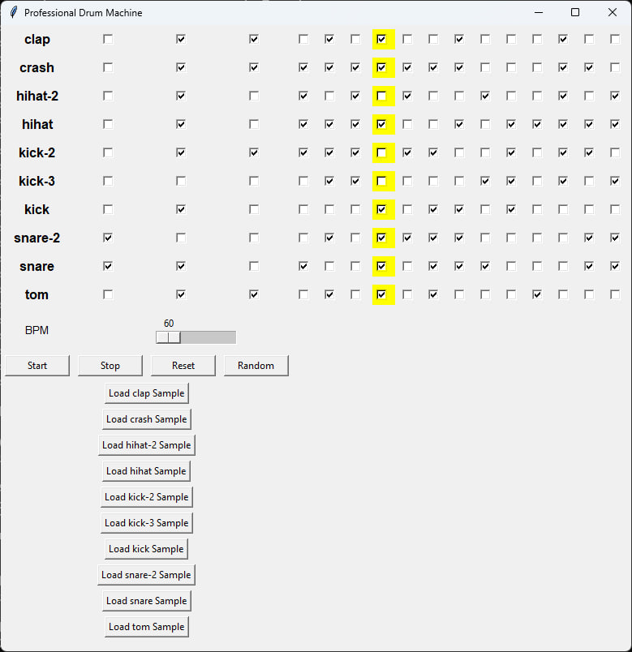

# Professional Drum Machine (Drum Machine)

A Python-based drum machine with a graphical user interface using Tkinter and Pygame.



## Features

- Load and play custom drum samples
- 16-step sequencer for rhythm programming
- Adjustable BPM (60-240 BPM)
- Start, stop, and reset sequence
- Random beat generator
- User-friendly GUI with easy-to-use buttons

## Installation

### Prerequisites

Ensure you have Python installed (3.x recommended). You also need to install the required dependencies:

```sh
pip install pygame
```

## Usage

Run the application with:

```sh
python app.py
```

### Controls

- **Start**: Begins playing the programmed sequence
- **Stop**: Stops playback
- **Reset**: Clears all steps
- **Random**: Generates a random sequence
- **Load Sample**: Select custom `.wav` files for instruments
- **BPM Slider**: Adjusts playback speed

## Directory Structure

```
DrumMachine/
├── sounds/          # Folder for .wav sample files
├── app.py           # Main application script
├── README.md        # Documentation
└── requirements.txt # Dependencies (optional)
```

## Adding Custom Sounds

Place `.wav` files inside the `sounds/` directory. The app automatically detects available samples.

## License

This project is licensed under the MIT License - see the [LICENSE](LICENSE) file for details.

## Copyright

(c) 2025 Max Base
